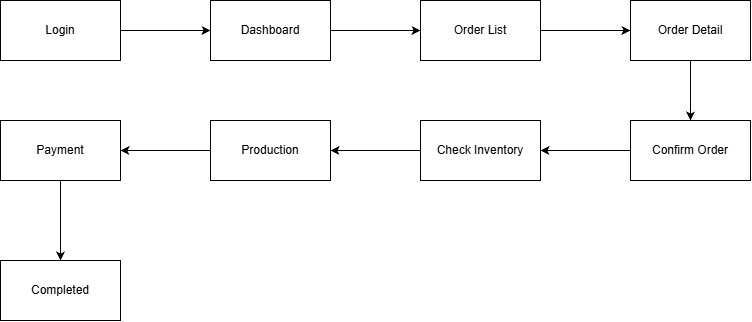

# User Flow

## 1. Overview

Dokumen ini menjelaskan alur interaksi pengguna dengan sistem ERP Mobile. User Flow disusun berdasarkan Business Process, Requirement, dan Modules untuk menggambarkan bagaimana setiap pengguna berinteraksi dengan aplikasi.

## 2. Customer Flow

  

<b>Gambar 4.0.</b> Current Business Process (TO-BE)

| Step | Activity                                    |
| ---- | ------------------------------------------- |
| 1    | Membuka Guest Ordering                      |
| 2    | Melihat daftar menu                         |
| 3    | Memilih menu                                |
| 4    | Menentukan jumlah                           |
| 5    | Menentukan waktu pengambilan                |
| 6    | Menambahkan kustomisasi (opsional)          |
| 7    | Mengisi nama dan nomor HP                   |
| 8    | Mengirim pesanan                            |
| 9    | Melihat konfirmasi pesanan berhasil dikirim |

## 3. Owner Flow

  

<b>Gambar 4.0.</b> Current Business Process (TO-BE)

| Step | Activity                                     |
| ---- | -------------------------------------------- |
| 1    | Login ke ERP Mobile                          |
| 2    | Melihat Dashboard                            |
| 3    | Membuka daftar pesanan                       |
| 4    | Melihat detail pesanan                       |
| 5    | Memperbarui detail pesanan (jika diperlukan) |
| 6    | Mengonfirmasi pesanan                        |
| 7    | Memeriksa ketersediaan bahan baku            |
| 8    | Menyusun jadwal produksi                     |
| 9    | Melakukan produksi                           |
| 10   | Melakukan pengemasan                         |
| 11   | Mencatat pembayaran                          |
| 12   | Menyelesaikan pesanan                        |

## 4. Navigation Summary

| User     | Screen         |
| -------- | -------------- |
| Customer | Guest Ordering |
| Customer | Menu           |
| Customer | Checkout       |
| Customer | Success        |
| Owner    | Login          |
| Owner    | Dashboard      |
| Owner    | Order List     |
| Owner    | Order Detail   |
| Owner    | Inventory      |
| Owner    | Production     |
| Owner    | Payment        |
